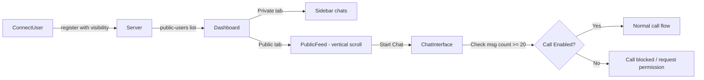

# Public / Private Mode Feature

Users can toggle between **Private** (current behavior — number-based direct contact) and **Public** (discoverable in a scrollable feed). Public users appear in an Instagram reels-like vertical scroll. Chat is instant, but calls are gated behind a 20-response threshold.

## Architecture



## Proposed Changes

### Backend

#### [MODIFY] [server.js](file:///home/prince/Desktop/Code/Lets_talk/backend/server.js)

- Add `visibility` field (`public`/`private`) to user data, default `private`
- Add `set-visibility` event to toggle public/private
- Broadcast `public-users-update` to all sockets whenever the public user list changes (join, leave, toggle)
- Track per-pair message counts: `messageCounts[senderNumber][receiverNumber]++`
- Add `get-message-count` request so frontend can query how many messages were received from a specific user
- Add `request-call-permission` / `call-permission-response` events for sub-threshold calls
- Include `visibility` and `avatarColor` (random) in user data for the feed

---

### Frontend Components

#### [MODIFY] [ConnectUser.jsx](file:///home/prince/Desktop/Code/Lets_talk/frontend/src/components/ConnectUser.jsx)

- Add a toggle for "Go Public" / "Stay Private" during registration
- Pass visibility choice to the `register` event

#### [MODIFY] [Dashboard.jsx](file:///home/prince/Desktop/Code/Lets_talk/frontend/src/components/Dashboard.jsx)

- Add tab bar at top of sidebar: **Private** | **Public**
- Private tab = current sidebar chat list
- Public tab = render `PublicFeed` component in the main content area
- Listen for `public-users-update` and store the list
- Add visibility toggle button in sidebar header
- Handle `call-permission-request` / `call-permission-response` overlays

#### [NEW] [PublicFeed.jsx](file:///home/prince/Desktop/Code/Lets_talk/frontend/src/components/PublicFeed.jsx)

Instagram reels-style full-screen vertical snap-scroll feed:
- Each "card" is a full-viewport user profile with avatar, name, number
- Vertical scroll with CSS `scroll-snap-type: y mandatory`
- Each card has a "Start Chat" button
- Cards show visual indicators (online dot, avatar with random gradient)
- Smooth snap scrolling between users

#### [MODIFY] [ChatInterface.jsx](file:///home/prince/Desktop/Code/Lets_talk/frontend/src/components/ChatInterface.jsx)

- Accept `isPublicChat` and `receivedMessageCount` props
- If `isPublicChat` and `receivedMessageCount < 20`: disable call buttons, show lock icon with "Chat 20 messages to unlock calls" tooltip
- If threshold met: enable call buttons with an unlock animation
- Track incoming message count locally and request updated count from server

#### [MODIFY] [index.css](file:///home/prince/Desktop/Code/Lets_talk/frontend/src/index.css)

- Public feed snap-scroll container styles
- User profile card styles (full-height, centered content, gradient backgrounds)
- Tab bar styles
- Call-locked indicator styles
- Visibility toggle styles

## Call Gating Logic

```
if (mode === 'private'):
    calls always allowed (current behavior)
    
if (mode === 'public'):
    messagesReceivedFromPeer = server.getMessageCount(peer → me)
    if messagesReceivedFromPeer >= 20:
        calls enabled automatically
    else:
        show "Send X more messages to unlock calls"
        OR send call permission request
```

## Verification Plan

### Manual Testing
1. Register two users — one Public, one Private
2. Verify the Public user appears in the reels-style feed
3. Start chat from the feed → verify chat works
4. Verify call buttons are locked initially
5. Send 20 messages from the public user → verify call buttons unlock
6. Toggle visibility → verify user appears/disappears from feed
7. Private mode still works exactly as before
